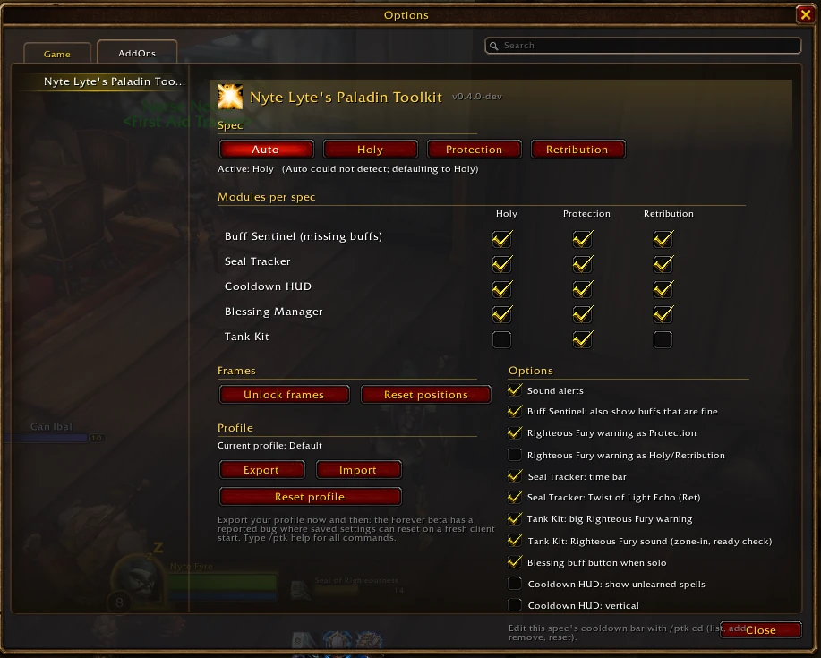
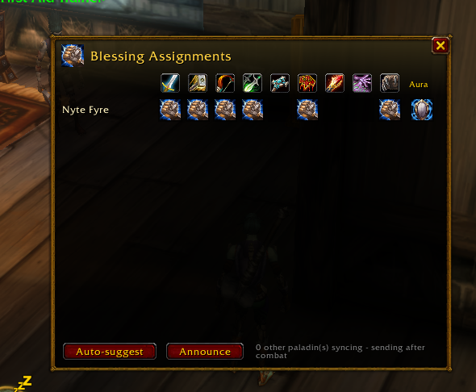
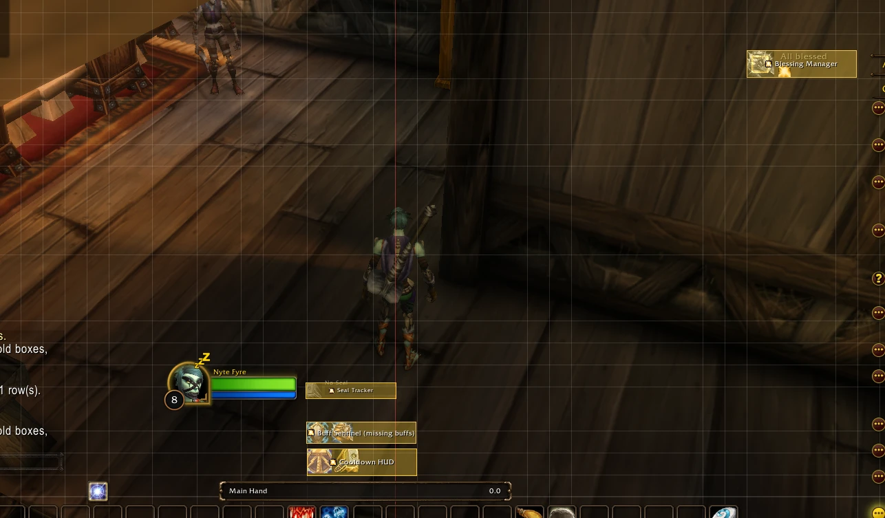

# Nyte Lyte's Paladin Toolkit

An all-in-one Paladin addon for **World of Warcraft: Forever**. It replaces a
stack of WeakAuras and PallyPower with one addon, tuned for **Holy,
Protection or Retribution**, with every part switchable per spec.

## What it does

- **Spec choice:** Auto, Holy, Protection or Retribution. Each spec has its
  own modules, cooldown bar and frame positions. Switch with `/ptk holy`
  and so on, from the settings panel, or with a keybind. No reload needed.
- **Buff Sentinel:** icons pop up when your Aura or Blessing is missing, or
  about to run out (they pulse with the time left). Also covers Righteous
  Fury as Protection, and your Seal while you're in combat. `/ptk check` and
  ready checks report everything in chat.
- **Seal Tracker:** your active Seal with a draining time bar. For
  Retribution it also shows **Twist of Light's Echo**.
- **Cooldown HUD:** a row of your spec's cooldowns with swipes that work in
  combat. It ignores the global cooldown, and dispels only show while you're
  in a group. Edit it with `/ptk cd`.
- **Tank Kit** (Protection): a big Righteous Fury warning, large icons for
  the tanking core, **TAUNT** on Judgement under Seal of Fury, and an Iron
  Creed timer.
- **Blessing Manager**, PallyPower-style:
  - An assignment grid for every paladin in the group.
  - Auto-suggest, and syncing between paladins who run the addon.
  - A buff button: **one press casts your assigned Blessing on the next
    person missing it.** It never casts on its own.
- **Profile export/import** as one text string. It's the workaround for the
  beta's settings-reset bug, and a way to share setups.

### How it deals with Forever's combat restrictions

Forever hides most combat information from addons ("secret values"). This
addon follows Blizzard's rules:

- **It never reads what it's not allowed to.** It has no combat log, threat
  meter, enemy tracking or rotation advice.
- **It never automates chat, whispers or raid marks.** "Announce" in the
  Blessing grid only posts when you click it.
- **Your buffs are hidden in combat,** so the addon keeps what it saw
  before the pull, keeps counting timers down, and follows your own casts,
  which stay visible. Anything worked out this way is marked with `*`.
- **Cooldown swipes are drawn by the game itself**, so they keep working
  in combat.
- **Blessing sync pauses in combat and during boss fights,** and catches
  up afterwards.

## Install

1. Download the latest `NyteLytePaladinToolkit-<version>.zip`.
2. Unzip it into your AddOns folder, so the result is
   `...\Interface\AddOns\NyteLytePaladinToolkit\NyteLytePaladinToolkit.toc`.
   - Beta: `World of Warcraft\_classic_beta_\Interface\AddOns\`
   - Launch: the Forever client's `Interface\AddOns\` folder. The final
     folder name wasn't known yet at the time of writing.
3. Log in and type `/ptk`.

## Commands

| Command | What it does |
|---|---|
| `/ptk` | Open settings (Options > AddOns) |
| `/ptk auto` / `holy` / `prot` / `ret` | Choose the spec mode |
| `/ptk spec` | Show the active spec and what Auto detected |
| `/ptk unlock` / `lock` / `reset` | Move frames, lock them, reset positions for this spec |
| `/ptk check` | Check your Seal, Aura, Blessing and Righteous Fury now |
| `/ptk cd` | List this spec's cooldowns; `add <spell>`, `remove <spell>`, `group <spell>` (show only in a group), `reset` |
| `/ptk bless` | Open the Blessing assignment grid |
| `/ptk export` / `import` | Copy your profile as text / paste one in |
| `/ptk errors` | Show Lua errors the addon caught this session |
| `/ptk probe`, `/ptk probe combat`, `/ptk show`, `/ptk debug` | Diagnostics (see below) |

**Keybindings** (Key Bindings > AddOns): Buff next missing Blessing, Cycle
spec mode, Lock/unlock frames, Open Blessing grid.

## Known limitations (beta)

- Forever's beta has a reported bug where saved settings don't load on a
  fresh client start. Use `/ptk export` now and then.
- Auto spec detection currently uses tree-specific spells you know. Detection
  from talent points will be added once it's verified on a level 10+
  character.
- Beta characters are capped at level 20. Some later spells and talents
  (Seal of Fury, Templar's Bulwark, Twist of Light, Iron Creed) couldn't be
  verified yet. Their names and durations are best guesses that correct
  themselves once the addon sees the real buffs.
- Whether party members' buffs can be read out of combat hasn't been checked
  yet. If they can't be read, the buff button won't treat them as missing.

## Diagnostics and bug reports

`/console scriptErrors 1` shows Lua errors. `/ptk probe` records what your
client supports, and `/ptk probe combat` does the same during your next fight.
Both are saved to
`WTF\Account\<account>\SavedVariables\NyteLytePaladinToolkit.lua` on
`/reload`. Attaching that file to a bug report helps a lot.

## Development

- `python tests/run_tests.py` runs the whole addon against a mocked WoW API
  under Lua 5.1: three client variants, every module's flows, the pure-logic
  unit tests, a check that no secret value ever gets saved, and a
  global-variable leak check. It needs `pip install lupa`.
- `python tools/package.py` builds `dist/NyteLytePaladinToolkit-<version>.zip`.
- `tools/install.ps1` links a clone into the AddOns folder for live
  `/reload` testing.
- `docs/PROBE_LOG.md` records what has been verified on the real client.

## License

MIT, free and open source, as Blizzard's addon policy requires.
